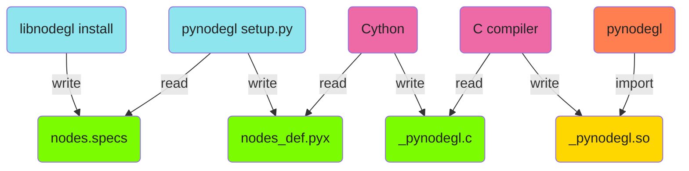

How the Python binding is created
=================================

## Simplified overview

## Detailed steps

### libnodegl → nodes.specs

`libnodegl` writes the [nodes.specs][specs] specifications in YAML using a
dedicated tool ([gen_specs.c][gen-specs-c]) crawling the internal node C
definitions.

This generated `nodes.specs` file (see `updatespecs` build rule in libnodegl's
generated `Makefile`) is installed on the system or targeted environment by the
`install` rule.

[specs]: /libnodegl/nodes.specs
[gen-specs-c]: /libnodegl/gen_specs.c

### nodes.specs ← pynodegl

In its [setup.py][pynodegl-setup], `pynodegl` uses `pkg-config` to query the
`libnodegl` installation data directory, in order to obtain the path to the
installed `nodes.specs` file. The file is then loaded as YAML file.

[pynodegl-setup]: /pynodegl/setup.py

### pynodegl → nodes_def.pyx

Using the loaded `nodes.specs` as YAML, `setup.py` writes the Cython code
definitions into a `nodes_def.pyx` file.

### nodes_def.pyx ← Cython

The `setuptools` module used to package `pynodegl` calls Cython to read the
generated `.pyx` file (along with [_pynodegl.pyx][pynodegl-pyx]).

### Cython → _pynodegl.c

From the `.pyx` files, Cython will generate a C source code using the C
Python API. This source file declares the Python classes calling the libnodegl
C functions, based on the rules contained in the `.pyx` files.

### _pynodegl.c ← C compiler

In the Cython toolchain triggered by the `setuptools`, a C compiler will compile
the generated C source.

### C compiler → _pynodegl.so

Compiled source ends up being linked against Python library to create a
`_pynodegl.so` loadable Python module.

[pynodegl-pyx]: /pynodegl/_pynodegl.pyx

### pynodegl ← _pynodegl.so

The final binding exposed to the user is a traditional pure Python module,
which imports the native `_pynodegl` module. All the nodes and their methods
are dynamically generated into that module at runtime.
