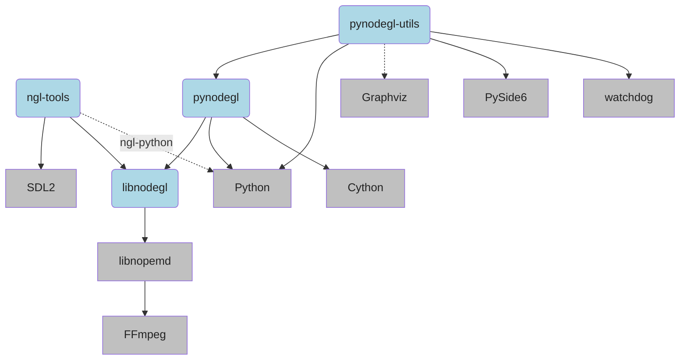

Project architecture and organization
=====================================

The `node.gl` project is split in several parts:

- `libnodegl`: the core of the project, an `OpenGL` engine in `C`, containing
  all the nodes.
- `ngl-tools`: a set of various program tools using `libnodegl`.
- `pynodegl`: a Python binding for `libnodegl` (with the help of `Cython`) to
  create graph scenes in the most simple way.
- `pynodegl-utils`: various Python utilities and examples such as an advanced
  Qt5 controller with many features such as live editing.

## Dependencies

- `libnodegl` requires a standard C toolchain and [meson build system][meson].
  It also depends on [nope.media][nope_media] (libnopemd) for media (video and
  images) playback. [Graphviz][graphviz] is optional but can be used to render
  and preview graphs obtained from the API.
- `ngl-tools` needs [SDL2][sdl2] and `libnodegl` installed.
- `pynodegl` needs [Python][python] and [Cython][cython], and `libnodegl`
  installed.
- `pynodegl-utils` needs [Python][python] and `pynodegl`. The controller depends on
  `PySide6` (which is the main reason why this package is separated from the
  `pynodegl` package). It is also recommended to install [Graphviz][graphviz]
  in order to render graph in the controller.

[meson]: https://mesonbuild.com/
[nope_media]: https://github.com/nope-project/nope.media
[graphviz]: http://www.graphviz.org/
[python]: https://www.python.org/
[cython]: http://cython.org/
[sdl2]: https://www.libsdl.org/
