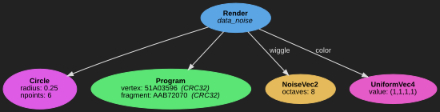
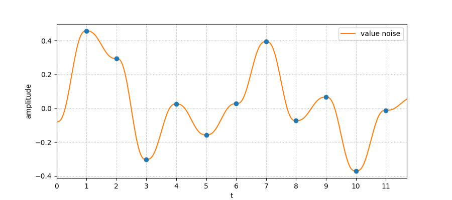
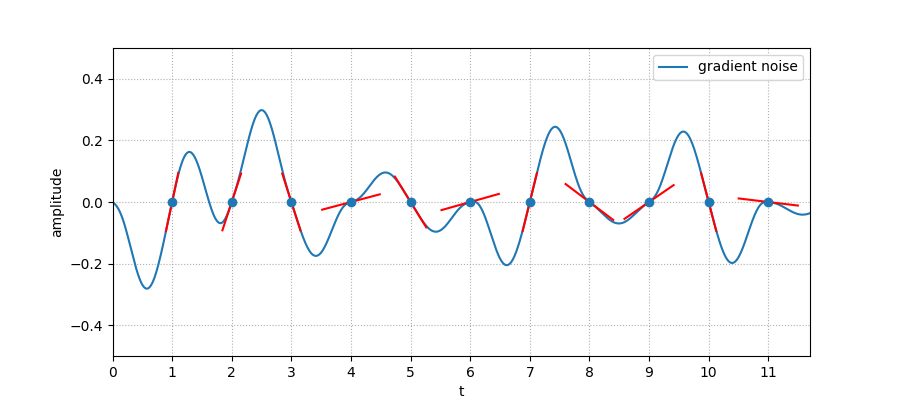
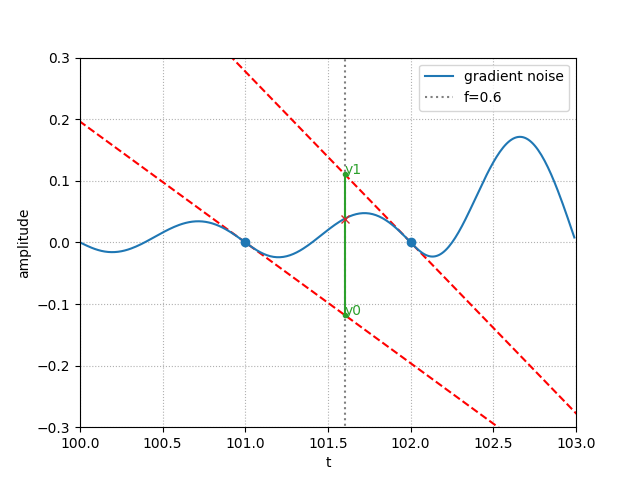
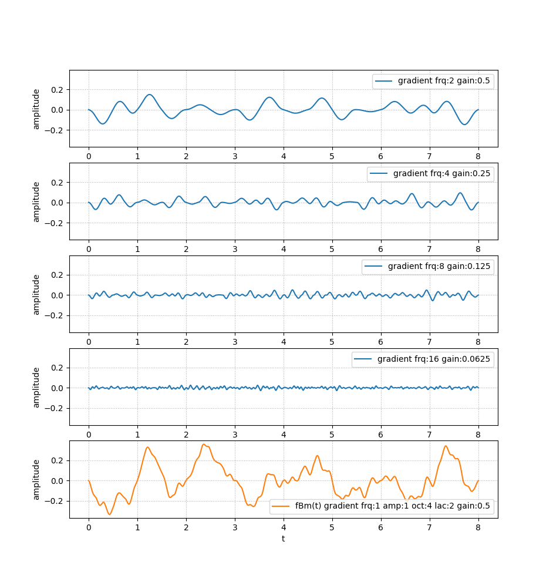

# How the Noise node works

## Nodes

The `Noise*` nodes works like other `Uniform*` nodes: they produces a
deterministic noisy signal which can be made available to the shader when
attached to the associated `Render` or `Compute`.

In the case of the `NoiseFloat`, the shader obtains a `float` sample
corresponding to the noise signal at a given time `t`. Similarly, `NoiseVec2`,
`NoiseVec3` and `NoiseVec4` will respectively provides a `vec2`, `vec3` and
`vec4` to the shader, where each component of the vector provides a different
signal with the same parameters.

The node themselves can not be used to create advanced patterns/fractals or
even display a waveform within a shader because there is only one random value
at a given time. On the other hand, it can typically be used to "wiggle" an
object or a parameter.

This mechanism could be implemented fully in GPU, but a GPU hash function can
be costly, difficult to get right, and hardly shared between pipelines. Having
the `Noise` builtin and CPU side allows a fast random generation as well as
sharing the signal between different branches. It gives shader a simple and
efficient source of noise that can be used in various creative situations.

### Seed

Behind the scene, there is only one signal of noise generated. In order to make
different signals, the `Noise*.seed` parameter can be used.  In practice, the
seed acts as an offsetting of the time `t` (in seconds), meaning you likely
want to keep seeds relatively apart from each other.

That same mechanism is used internally to decorrelate components in the
`NoiseVec2`, `NoiseVec3` and `NoiseVec4` nodes, using the `seed` parameter only
as base seed (the first component).

## Algorithm

### Random source

At the most elementary level, we generate random values from x-axis values. The
hashing function we use is [lowbias32 from Chris Wellons][lowbias32], converted
to a float between `0.0` and `1.0`.  This hashing function makes sure that for
a given integer (the lattice / integer coordinate), we will always provide the
same float value with a uniform distribution.

We can not use a [PRNG][prng] because it relies on a state where we need
determinism (for one coordinate, we always want the same random value).
[LCG][lcg] are a sub-classes of PRNG where the state is actually the returned
value. But even then, we can not re-use the previously returned value since we
need seeking; that is the ability to get the random value associated with our
integer coordinate. Trying to feed a PRNG/LCG with our coordinate instead of
the expected state would be equivalent to changing the seed at every call, and
this creates an important bias in the random distribution. This is the reason
why we need integer hashing instead. `lowbias32` has been derived from an
advanced generator and was evaluated to be extremely good.

### Random signal

Using these random values as "key frames" and interpolating between them would
give us a **Value Noise**, as illustrated below:

The patterns generated in such a way are not desirable due to the variation in
frequencies: when points are close the frequency is low, and can suddenly
fluctuates. So instead of using the random values as the noise signal itself,
we interpret them as gradient: this is the **Gradient Noise**, used in the
popular [Perlin Noise][perlin-noise]. In our case, since we use a 1D signal, it
looks like the following:

Random values of `0` and `1` (the output of the hash function rescaled into a
float) respectively correspond to a tilt of `-45°` (`-π/4`) and `45°` (`π/4`).

The interpolation between 2 gradient points works that way: for a given time
value `t` between 2 gradients, we obtain two y-axis coordinates by extending
the line of each of these gradients. The signal value at `t` lies somewhere
between these 2 points: `y0` and `y1` are the boundaries of the interpolation.
`f` is used to represent the x-axis distance between `t` and each lattice
(where the gradients are located); we use it as an amount for the non-linear
interpolation (see next section for the formulas) to get the finale value.

**Note**: one important property of the gradient noise is that it passes
through 0 at every lattice / cycle.

### Interpolants

The two common interpolation functions are:

1. the [Cubic Hermite curve][hermite], `f(t)=3t²-2t³` (typically used in GLSL
   `smoothstep()`) initially used by Ken Perlin in his first Perlin Noise
   implementation
2. the more modern (and complex) quintic curve `f(t)=6t⁵-15t⁴+10t³` introduced
   in 2002 by Ken Perlin in his proposed improved version of the Perlin Noise,
   in order to address discontinuities in the 2nd order derivatives `f"(t)`.

Both functions are available in the `Noise*.interpolant` parameter, along with
a linear interpolation `f(t)=t` which can be used for debugging purpose. It is
not recommended to use that one for another purpose because it will cause an
undesired output (flat curve) if the gradients are oriented the same.

### Accumulation

The finale noise is generated using a form of [fractional Brownian
motion][fbm], which basically means multiple layers of gradient noise are
added together to create a refined pattern. The parameter controlling the
number of layers accumulated is `Noise*.octaves`.

With the standard parameters, each octave will see its frequency double
(`Noise*.lacunarity=2`) and its amplitude halved (`Noise*.gain=½`) from the
previous one.  The gain is also known as *persistence*, and in its mathematical
form derived from the [Hurst exponent][hurst]. This gain/persistence/Hurst
notion refers to the same thing, which is the "memory" between octaves, or
self-similarity.

As stated earlier, the gradient noise crosses 0 on every lattice. Even when
cumulated with other frequencies, this pattern will remain if the lacunarity is
an integer. Using `1.98` instead of `2.0` can prevent this (of course, with
more than one octave).

[lowbias32]: https://nullprogram.com/blog/2018/07/31/
[prng]: https://en.wikipedia.org/wiki/Pseudorandom_number_generator
[lcg]: https://en.wikipedia.org/wiki/Linear_congruential_generator
[perlin-noise]: https://en.wikipedia.org/wiki/Perlin_noise
[hermite]: https://en.wikipedia.org/wiki/Hermite_curve
[fbm]: https://en.wikipedia.org/wiki/Fractional_Brownian_motion
[hurst]: https://en.wikipedia.org/wiki/Hurst_exponent
