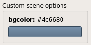
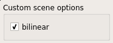
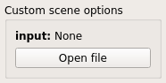
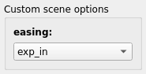
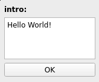

pynodegl-utils
==============

[pynodegl-utils][pynodegl-utils] provides various utilities around `node.gl`
and its Python binding. Its core tool is the Qt viewer with all its
peripheral features such as the exporter or the tooling for easing the
creation of `node.gl` scene graphs.

[pynodegl-utils]: /pynodegl-utils


## Viewer scenes

Each scene needs to be decorated with the `misc.scene` decorator to be
recognized by the `ngl-viewer`.

**Example**:

```python
from pynodegl_utils.misc import scene

@scene()
def my_scene(cfg):
    ...
```

The first argument of the scene function is always a `cfg` argument is of type
`pynodegl_utils.SceneCfg` and can be read and written by the scene function.
Extra optional arguments to the scene function are allowed.

Every scene must return a valid `pynodegl` node object.


## Viewer widgets

Widgets are specified as named object arguments to the `@misc.scene` decorator.
The `@misc.scene()` arguments must match the name of the corresponding argument
in the scene construction function.

**Note**: it is not mandatory to create a widget definition for every optional
scene function argument.

**Example**:

```python
@scene(foo=scene.Bool(), bar=scene.Color())
def example(cfg, foo=True, bar=(1.0, 0.2, 0.5, 1.0)):
    ...
```

List of available widget types:

### scene.Range

A `Range` is associated with a **slider** widget.

Available options:

Option      | Description
----------- | -----------
`range`     | the range itself, as a `list` or a `tuple` of 2 values
`unit_base` | `1/unit_base` corresponds to the sliders step

The associated argument value is expected to be a scalar value.

**Example**:

```python
@scene(n=scene.Range(range=[0, 5], unit_base=100))
def range_example(cfg, n=2.5):
    ...
```


### scene.Vector

A `Vector` is associated with a pack of spin boxes.

Available options:

Option      | Description
----------- | -----------
`n`         | vector len
`minv`      | smallest possible vector
`maxv`      | largest possible vector

The associated argument is expected to be a `tuple` of `n` floats.

**Example**:

```python
@scene(vec=scene.Vector(n=4, minv=(-1, -1, -1, -1), maxv=(1, 1, 1, 1)))
def vector_example(cfg, vec=(0.4, -0.75, -0.2, 1.0))
    ...
```


### scene.Color

A `Color` is associated with a **color picker** widget.

The associated argument value is expected to be a 4-value `tuple` or `list`.

**Example**:

```python
@scene(bgcolor=scene.Color())
def color_example(cfg, bgcolor=(0.3, 0.4, 0.5, 1.0)):
    ...
```



### scene.Bool

A `Bool` is associated with a **check box** widget.

The associated argument is expected to be a `bool`.

**Example**:

```python
@scene(bilinear=scene.Bool())
def bool_example(cfg, bilinear=True):
    ...
```



### scene.File

A `File` is associated with a **file chooser** widget.

The associated argument is expected to be a `str` or `None`, corresponding to
the file path.

Available options:

Option      | Description
----------- | -----------
`filter`    | a `str` identifying the type of file supported (refer to the `QtWidgets.QFileDialog` documentation for more details)

**Example**:

```python
@scene(input=scene.File(filter='Text files (*.txt)'))
def file_example(cfg, input=None):
    ...
```



### scene.List

A `List` is associated with a **combo box** widget.

The associated argument is expected to be a `str` present in the choices.

Available options:

Option      | Description
----------- | -----------
`choices`   | a list of `str`

**Example**:

```
@scene(easing=scene.List(choices=('linear', 'exp_in', 'sinus_in')))
def anim(cfg, easing='exp_in'):
    ...
```



### scene.Text

A `Text` is associated with an **input text** widget.

The associated argument is expected to be a `str`.

**Example**:

```
@scene(intro=scene.Text())
def demo(cfg, intro='Hello World!'):
    ...
```



## Viewer hooks

When using the `--hooks-dir` option, `ngl-viewer` will execute various hook
according to various events. These hooks are typically used for triggering a
synchronization with external devices.

Following are the hook scripts or programs that will be executed and their
expected behaviour.

### hook.get_sessions

`hook.get_sessions` does not take any argument. It must print on `stdout` all
the available sessions. Each line represents one session. The first word of
each line represent the session identifier and must be unique. The rest of the
line is a description of the session.

**Example**:

```shell
$ ./hook.get_sessions
X2fca1f2c device Foobar 3000
Y5fd953df Smartphone 9000 GEN X
```

### hook.get_session_info

`hook.get_session_info` takes a session ID as argument. It must print on
`stdout` the backend and system in the `key=value` form.

Accepted values for the `backend`:

- `gl`
- `gles`

Accepted values for the `system`:

- `Linux`
- `Android`
- `Darwin`
- `iOS`

**Example**:

```shell
$ ./hook.get_session_info X2fca1f2c
backend=gles
system=Linux
```

### hook.sync_file

`hook.sync_file` takes 3 arguments:

1. `session_id`: the session identifier
1. `ifile`: the path to the local file
2. `ofile`: the output filename (not path)

It is called for every file to sync (typically media files).

The hook must print on `stdout` the output file path.

**Example**:

```shell
$ ./hook.sync_file Y5fd953df /tmp/ngl-media.mp4 media-001.mp4
/mnt/data/ngl-data/media-001.mp4
```

### hook.scene_change

`hook.scene_change` takes several arguments:

- first argument is the session identifier
- second argument is the `localscene`: the path to the local serialized scene
- every following argument is a key-value string following the format
  `key=value`. Available named variables are following:
  - `duration`: expressed as a float (in seconds)
  - `aspect_ratio`: expressed as a fraction in format `num/den` where `num` and `den` are `int`
  - `framerate`: expressed as a fraction in format `num/den` where `num` and `den` are `int`
  - `clear_color`: expressed as a 32-bit hexadecimal following the `RRGGBBAA` format
  - `samples`: number of samples used for multisample anti-aliasing expressed as an integer

**Example**:

A call from `ngl-viewer` to this hook will look like this:

```shell
$ ./hook.scene_change X2fca1f2c /tmp/ngl_scene.ngl duration=5 framerate=60000/1001 aspect_ratio=16/9 clear_color=4A646BFF samples=4
```
