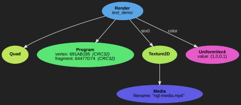
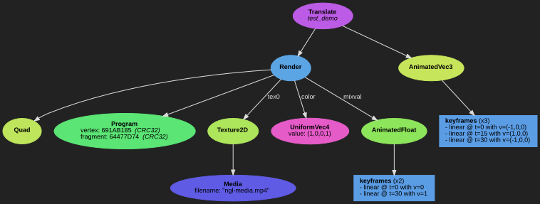

🔰 Starter tutorial
===================

This starter tutorial will guide you through the installation and basic usage
of `node.gl`. At the end of this tutorial, you will be able to write your own
demo scripts in Python and how to read the advanced technical documentation for
your future creative adventures.

## 🏗️ Quick user installation

The following steps describe how to install `node.gl` and its dependencies in
your home user directory, without polluting your system (aside from the system
dependencies which you should install and remove in sane ways).

### Dependencies

Make sure you have installed on your system the essential list of dependencies
for building and running the complete **node.gl** stack:

- **GCC** or **Clang**
- **GNU/Make**
- **Git**
- **FFmpeg**
- **Cython** (Python 2 version)
- **Python 2.x** (you will need the package with the build headers as well,
  typically named with a `-dev` suffix on Debian based systems)
- **pip2**
- **Qt5** and its Python 2 binding: **PyQt5**
- **Graphviz**
- **GLFW3**

This tutorial will not cover the installation of these tools, but they are
fairly standard and packaged for many systems.

### Installing the full stack in a subdirectory of your home directory

We will build and install node.gl in an arbitrary `$NGLDIR` variable:

```shell
export NGLDIR=$HOME/ngl-build
mkdir -p $NGLDIR/env
```

Customize it at will, but make sure it is an absolute path where you have write
permissions.

Clone the two essential source repositories:

```shell
git clone https://github.com/stupeflix/sxplayer $NGLDIR/sxplayer
git clone https://github.com/gopro/gopro-lib-node.gl $NGLDIR/node.gl
```

Prepare your make for a parallel build (optional, but will make the process
much faster):

```shell
alias make="make -j8"
```

Replace `8` with the number of parallel job your system can handle. On
GNU/Linux you can typically rely on `nproc` to obtain this value.


Install the C packages:

```shell
cd $NGLDIR/sxplayer
make install PREFIX=$NGLDIR/env
cd $NGLDIR/node.gl/libnodegl
PKG_CONFIG_PATH=$NGLDIR/env/lib/pkgconfig make install PREFIX=$NGLDIR/env
cd $NGLDIR/node.gl/ngl-tools
PKG_CONFIG_PATH=$NGLDIR/env/lib/pkgconfig make install PREFIX=$NGLDIR/env
```

Install in developer mode the Python packages and their dependencies:

```shell
cd $NGLDIR/node.gl
PKG_CONFIG_PATH=$NGLDIR/env/lib/pkgconfig pip2 install --user -e ./pynodegl
pip2 install --user -r ./pynodegl-utils/requirements.txt
pip2 install --user -e ./pynodegl-utils
```

One last step is to make sure to have the Python user bin directory in your
`PATH`, typically `$HOME/.local/bin/`. Similarly, the *ngl-tools* can be found
in `$NGLDIR/env/bin`. In your shell configuration (`~/.bashrc`, `~/.profile` or
wherever you configure your paths), you will set something along the lines:

```shell
export NGLDIR=$HOME/ngl-build
export PATH=$PATH:$HOME/.local/bin:$NGLDIR/env/bin
```

## 👁️ Running the demo viewer

When running `ngl-viewer` for the first time and selecting a scene, you should
see something like this:


All the scenes listed on the left tree view can be found in the
[pynodegl_utils.examples][demo-tree] Python module. If you are curious on how
each demo scene operates, look into this place.

The default video being an overly saturated mire generated with FFmpeg, it is
not a very interesting asset for most demos. It is suggested to select your own
assets using the "Medias" tab, and then play around with the viewer and its
default demos. Some demo scenes also offer customization widgets (look at the
bottom left of the UI), check them out!

[demo-tree]: /pynodegl-utils/pynodegl_utils/examples


## 🐍 Creating a simple scene in Python

### My first demo scene

Now that you are familiar with the viewer, we are going to write our own first
demo.

Edit a script such as `~/mydemo.py` and add the following:

```python
import pynodegl as ngl
from pynodegl_utils.misc import scene

@scene()
def test_demo(cfg):
    geometry = ngl.Quad()
    media = ngl.Media(cfg.medias[0].filename)
    texture = ngl.Texture2D(data_src=media)
    render = ngl.Render(geometry)
    render.update_textures(tex0=texture)
    return render
```

You should be able to preview your scene with `ngl-viewer -m ~/mydemo.py` and
observe a centered quadrilateral geometry with the video playing in it. But
first, let's look at the `Graph view` tab in the viewer to understand the scene
we just crafted:


To formulate what we observe here, we'll say the following: the `Render` is the
node orchestrating the render of the `Texture2D` (identified by "*tex0*") in the
`Quad` geometry, using the `Media` as data source for filling the texture.

### Pimp my demo with a GPU program

**Note**: writing GLSL shaders is out of the scope of this tutorial, so we will
assume you are comfortable with the basis. If not, you may want to look at [the
book of shaders][book-of-shaders] or any beginner resource of your choice.

You may want to refer to the [vertex and fragment shader
parameters][expl-shaders] documetation to know which parameters are exposed by
`node.gl`.

We are now going to pimp a little our scene by adding a program shader. No need
to close `ngl-viewer` as it is supporting live code editing. The scene will be
reconstructed after every change in your sources.

If no program is specified to  `Render`, it will use a default one which looks
like this one (that's the code currently being used to render the texture into
the geometry):

```glsl
#version 100

precision highp float;
uniform sampler2D tex0_sampler;
varying vec2 var_uvcoord;
varying vec2 var_tex0_coord;
void main(void)
{
    gl_FragColor = texture2D(tex0_sampler, var_tex0_coord);
}
```

Instead of just picking into the texture, we will mix it with some red by
replacing the `gl_FragColor` assignment with the following:

```glsl
    vec4 color = vec4(1.0, 0.0, 0.0, 1.0);
    vec4 video = texture2D(tex0_sampler, var_tex0_coord);
    gl_FragColor = mix(video, color, 0.5);
```

Our new GLSL fragment shader can be specified as `fragment` parameter to the
`Program` node. Making sure the `Render` does use our custom program, our demo
becomes:

```python
import os.path as op
import pynodegl as ngl
from pynodegl_utils.misc import scene


@scene()
def test_demo(cfg):
    frag = open(op.join(op.dirname(__file__), 'mydemo.frag')).read()
    geometry = ngl.Quad()
    media = ngl.Media(cfg.medias[0].filename)
    texture = ngl.Texture2D(data_src=media)
    prog = ngl.Program(fragment=frag)
    ucolor = ngl.UniformVec4(value=(1,0,0,1))
    render = ngl.Render(geometry, prog)
    render.update_textures(tex0=texture)
    render.update_uniforms(color=ucolor)
    return render
```

With `~/mydemo.frag`:

```glsl
#version 100

precision highp float;
uniform sampler2D tex0_sampler;
varying vec2 var_uvcoord;
varying vec2 var_tex0_coord;
void main(void)
{
    vec4 color = vec4(1.0, 0.0, 0.0, 1.0);
    vec4 video = texture2D(tex0_sampler, var_tex0_coord);
    gl_FragColor = mix(video, color, 0.5);
}

```


[book-of-shaders]: http://thebookofshaders.com/
[expl-shaders]: /doc/expl/shaders.md

### Introducing uniforms

You may want to pass a bunch of parameters to your Program depending on how you
construct your scene. One way to do that is to craft a specific string for the
fragment shader. While this may make sense under certain rare circumstances,
in most cases you want to rely on **uniforms**. Uniforms will allow the re-use
of the same program in multiple renders, bringing maintenance and performance
benefits.

Setting up an uniform identified by "*color*" for our red color looks like
this:

```python
    ucolor = ngl.UniformVec4(value=(1,0,0,1))
    render.update_uniforms(color=ucolor)
```

In the GLSL code, you will access it by replacing the `vec4 color` local to the
`main()` function into a `uniform vec4 color` on top, along with the other
uniform declarations.

If you've correctly followed the above instructions, your graph tree will look
like this:



### Scene widgets

One way to adjust the red color is to edit the code and observe the result
in the `ngl-viewer` immediately. Another way is to integrate a widget directly
in the UI. For that, we can adjust the `@scene()` decorator and the
`test_demo()` prototype like the following:

```python
@scene(color=scene.Color())
def test_demo(cfg, color=(1,0,0,1)):
    ...
    ucolor = ngl.UniformVec4(value=color)
    ...
```


All the other widgets are documented in the [Viewer widgets
documentation][viewer-widgets].

[viewer-widgets]: /doc/ref/pynodegl-utils.md#viewer-widgets

### Animations

Some nodes support CPU animations, driven by the requested draw time.
Animations are composed of an interpolated holder (the animated node) and a set
of key frames.

One of the most common animation used is an animated uniform to represent time.
Typically, we want to access the normalized time in the fragment shader. But to
prevent any confusion we will create a more explicit shader parameter, how
about using a *mix value changing according to time*?

To achieve that in the construction of the scene, we will rely on
`cfg.duration` which contain the scene duration. By default, it is 30 seconds
long, but it can be changed directly in your function. We want to associate
`duration=0` with `mixval=0` and `duration=30` with `mixval=1`:

```python
    mixval_animkf = [ngl.AnimKeyFrameFloat(0, 0),
                     ngl.AnimKeyFrameFloat(cfg.duration, 1)]
    mixval_anim = ngl.AnimatedFloat(mixval_animkf)
```

And then use this animated float directly on the render:

```python
    render.update_uniforms(mixval=mixval_anim)
```

Just like `color`, we will transmit it to the shader through uniforms.
`~/mydemo.frag` ends up being:

```glsl
#version 100

precision highp float;
uniform sampler2D tex0_sampler;
uniform vec4 color;
uniform float mixval;
varying vec2 var_uvcoord;
varying vec2 var_tex0_coord;
void main(void)
{
    vec4 video = texture2D(tex0_sampler, var_tex0_coord);
    gl_FragColor = mix(video, color, mixval);
}
```

Uniforms are not the only nodes to support animation, nodes like
`Animated*`, `Camera`, or the transformation nodes we are studying next,
also support them.

### Transformations


Transformations come in 3 flavors: `Translate`, `Scale` and `Rotate`. Each of
these node can be stacked at will. Also, just like uniforms, they can be
animated according to time.

How about making our video *swing from left to right and back again*?

Let's first reduce the time of the demo to make things a bit more interesting:

```python
@scene(color=scene.Color())
def test_demo(cfg, color=(1,0,0,1)):
    cfg.duration = 3.
    ...

```

And create the translation with our previous `Render` as child:

```python
    translate_animkf = [ngl.AnimKeyFrameVec3(0, (-1, 0, 0)),
                        ngl.AnimKeyFrameVec3(cfg.duration/2., (1, 0, 0)),
                        ngl.AnimKeyFrameVec3(cfg.duration, (-1, 0, 0))]
    translate_anim = ngl.AnimatedVec3(keyframes=translate_animkf)
    translate = ngl.Translate(render, anim=translate_anim)
    return translate
```



At this point, our demo code looks like this:

```python
import os.path as op
import pynodegl as ngl
from pynodegl_utils.misc import scene


@scene(color=scene.Color())
def test_demo(cfg, color=(1,0,0,1)):
    cfg.duration = 3.

    # Render branch for my video
    frag = open(op.join(op.dirname(__file__), 'mydemo.frag')).read()
    geometry = ngl.Quad()
    media = ngl.Media(cfg.medias[0].filename)
    texture = ngl.Texture2D(data_src=media)
    prog = ngl.Program(fragment=frag)
    render = ngl.Render(geometry, prog)
    render.update_textures(tex0=texture)

    # Animated mixing color
    mixval_animkf = [ngl.AnimKeyFrameFloat(0, 0),
                     ngl.AnimKeyFrameFloat(cfg.duration, 1)]
    mixval_anim = ngl.AnimatedFloat(mixval_animkf)
    ucolor = ngl.UniformVec4(color)
    render.update_uniforms(color=ucolor)
    render.update_uniforms(mixval=mixval_anim)

    # Translation
    translate_animkf = [ngl.AnimKeyFrameVec3(0, (-1, 0, 0)),
                        ngl.AnimKeyFrameVec3(cfg.duration/2., (1, 0, 0)),
                        ngl.AnimKeyFrameVec3(cfg.duration, (-1, 0, 0))]
    translate_anim = ngl.AnimatedVec3(keyframes=translate_animkf)
    translate = ngl.Translate(render, anim=translate_anim)

    return translate
```

Little exercise suggestion: make your video do a 360° rotation using the
`Rotate` node.

### Playing with time (time range filters)

One last important brick in the `node.gl` creative workflow is the time range
control. Assuming your demo is segmented in multiple time sections, you will
need the help of the `TimeRangeFilter` node.

We will start with the current new scene template:

```python
import math
import random
import pynodegl as ngl
from pynodegl_utils.misc import scene

...

@scene()
def test_timeranges(cfg):
    cfg.duration = 6.0

    # predictible randomization
    random.seed(0)

    # 3 basic different shapes
    sz = 1/3.
    b = sz * math.sqrt(3) / 3.0
    c = sz * .5
    triangle = ngl.Triangle((-b, -c, 0), (b, -c, 0), (0, sz*.5, 0))
    square = ngl.Quad((-sz/2, -sz/2, 0), (sz, 0, 0), (0, sz, 0))
    circle = ngl.Circle(radius=sz/2., npoints=64)

    # Renders for each shape, sharing a common program for coloring
    prog = ngl.Program(fragment=cfg.get_frag('color'))
    renders = [
            ngl.Render(triangle, prog),
            ngl.Render(square, prog),
            ngl.Render(circle, prog),
    ]

    # Associate a different color for each shape
    for r in renders:
        color = [random.random() for i in range(3)] + [1]
        r.update_uniforms(color=ngl.UniformVec4(value=color))

    # Move them in different places
    translates = [
            ngl.Translate(renders[0], (-.5, 0, 0)),
            ngl.Translate(renders[1], (  0, 0, 0)),
            ngl.Translate(renders[2], ( .5, 0, 0)),
    ]

    # final group holding every render
    return ngl.Group(translates)
```

This template is using nodes we already met, with the introduction of the
following new ones:

- `Triangle` and `Circle`, which are just like `Quad`: basic geometries
- a `Group` as root node, for rendering multiple `Render`

You may also notice we picked a basic coloring fragment from `pynodegl_utils`
with `get_frag('color')`, grabbing the content of [color.frag][color-frag].

[color-frag]: /pynodegl-utils/pynodegl_utils/examples/shaders/color.frag


Now back on the original topic: how are we going to *make each shape appear and
disappear according to time?*

`TimeRangeFilter` behaves similarly to animated nodes in the sense that it
holds time key frames. If we want a branch to be hidden, then drawn, then
hidden again, we will need 3 `TimeRangeMode*` entries, such as:

```python
    ranges = [ngl.TimeRangeModeNoop(0), ngl.TimeRangeModeCont(1), ngl.TimeRangeModeNoop(4)]
    node = ngl.TimeRangeFilter(child, ranges)
```

Here, `child` will be hidden at `t=0` ("*Noop*" as in "*No operation*"), then
drawn starting `t=1` ("*Cont* as in "*Continuous*"), then hidden again starting
`t=4`.

Applying this new knowledge to our demo we can make our shapes appear and
disappear rhythmically:

```python
    ranges = [
        [ngl.TimeRangeModeNoop(0), ngl.TimeRangeModeCont(1), ngl.TimeRangeModeNoop(4)],
        [ngl.TimeRangeModeNoop(0), ngl.TimeRangeModeCont(2), ngl.TimeRangeModeNoop(5)],
        [ngl.TimeRangeModeNoop(0), ngl.TimeRangeModeCont(3), ngl.TimeRangeModeNoop(6)],
    ]
    range_filters = [ngl.TimeRangeFilter(translates[i], r) for i, r in enumerate(ranges)]
    return ngl.Group(range_filters)
```


## 🏊 Diving into the documentation

As parting words, here are some suggestions on how to deal with the rest of the
documentation, accessible from the [README](/README.md).

From here, if you you're looking at a specific area, you may want to look at
the [how-to guides][howto].

If you need to understand the *why* of certain design decisions or limitations,
the [discussions and explanations][expl] section will come to an help.

Finally, in every situation, you will feel the need to check out the [reference
documentation][refdoc] for austere but exhaustive information, and in
particular, [all the node definitions][ref-libnodegl]. The [pynodegl-utils
reference documentation][ref-pynodegl-utils] will typically offer many helpers
when starting a creative process.

[howto]:                 /README.md#-how-to-guides
[expl]:                  /README.md#%EF%B8%8F-discussions-and-explanations
[refdoc]:                /README.md#-reference-documentation
[ref-libnodegl]:         /libnodegl/doc/libnodegl.md
[ref-pynodegl-utils]:    /doc/ref/pynodegl-utils.md
