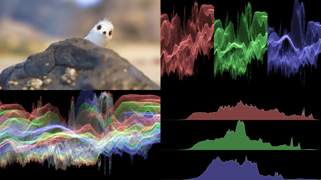

# Scopes

## Introduction

Scopes refers to a set of nodes:
- `ColorStats` doing the color analysis of a given textures and storing it into
  a data block
- `RenderWaveform` and `RenderHistogram` reading this data block and
  representing this data in a fancy way

This document explains how to work with them, and in particular how to exploit
the data block or build your own representation of the data.

This screenshot comes from the `pynopegl_utils.examples.scopes` demo.

## Requirements

`ColorStats` relies on compute shaders and SSBO, which are available pretty
much anywhere nowadays, but there are a few exceptions to keep in mind. MacOS
OpenGL support is not sufficient and you will need to enable the Metal backend
(through Vulkan/MoltenVK) to benefit from it. Also, some Android devices
officially support them, but experience showed that reality begs to disagree.

So while effort has been made such that `ColorStats` runs as fast as possible
and on all backends, your mileage may vary.

## RenderHistogram

The histogram (bottom-right in the screenshot) is a 2-dimensional
representation of the distribution of color in the input texture:
- the x-axis represents the intensity of the color: absence of light on the
  left, maximum light on the right
- the y-axis represents how much of each intensity is present in the texture

## RenderWaveform

The waveform spectrum (top-right and bottom-left in the screenshot) is a
3-dimensional representation of the distribution of color in the input texture:
- the x-axis is spatial: each column of pixels in the waveform is a
  mini-histogram of the same column of pixels on the input texture
- the y-axis represents the intensity of the color: absence of light on the
  bottom maximum light on the top; it is equivalent to the y-axis in
  `RenderHistogram`
- the z-axis represents how much of each intensity is present, and is
  communicated using the color intensity where black means 0 intensity and
  white the maximum intensity; it is an alternative representation of the
  y-axis in `RenderHistogram`

A simple way of understanding the representation is to consider that every
column of pixels is like looking at an histogram from above (a peak in the
histogram would be a bright color in the waveform)

## ColorStats

The `ColorStats` interface is essentially the same as a `Block`. This means
that in addition of being read by `RenderHistogram` and `RenderWaveform`, it
can be attached to `Render` vertex or fragment resources, or `Compute`
resources, and read in the corresponding shaders.

The following fields are accessible from the shader:

| Name            | Type     | Length             | Description                                                |
|-----------------|----------|--------------------|------------------------------------------------------------|
| `max_rgb`       | `uvec2`  | Single             | Maximum RGB value of summary and data                      |
| `max_luma`      | `uvec2`  | Single             | Maximum luma value of summary and data                     |
| `depth`         | `uint`   | Single             | Bit depth (256 for 8-bit, 1024 for 10-bit, …)              |
| `length_minus1` | `uint`   | Single             | Length of the image minus 1                                |
| `summary`       | `uivec4` | `depth`            | Global histogram data                                      |
| `data`          | `uivec4` | `depth` × `length` | `length` rows of histogram of size `depth` (waveform data) |

Additional details:

- We use the term "length" instead of "width" to because in the future it may
  correspond to the height.
- `summary` and `data` are 4-component long for R, G, B and luma
