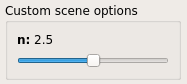
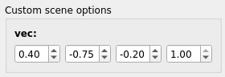
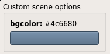
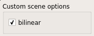
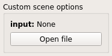
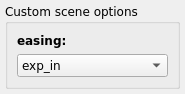
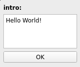

pynopegl-utils
==============

[pynopegl-utils][pynopegl-utils] provides various utilities around `nope.gl`
and its Python binding. Its core tool is the Qt controller with all its
peripheral features such as the exporter or the tooling for easing the
creation of `nope.gl` scene graphs.

[pynopegl-utils]: source:pynopegl-utils


## Controller scenes

Each scene needs to be decorated with the `misc.scene` decorator to be
recognized by the `ngl-control`.

**Example**:

```python
from pynopegl_utils.misc import scene

@scene()
def my_scene(cfg):
    ...
```

The first argument of the scene function is always a `cfg` argument is of type
`pynopegl_utils.SceneCfg` and can be read and written by the scene function.
Extra optional arguments to the scene function are allowed.

Every scene must return a valid `pynopegl` node object.


## Controller widgets

Widgets are specified using the `controls` argument in the `@misc.scene`
decorator. The keys of the `controls` dictionary must match the name of the
corresponding argument in the scene construction function.

**Note**: it is not mandatory to create a widget definition for every optional
scene function argument.

**Example**:

```python
@scene(controls=dict(foo=scene.Bool(), bar=scene.Color()))
def example(cfg, foo=True, bar=(1.0, 0.2, 0.5)):
    ...
```

List of available widget types:

### scene.Range

A `Range` is associated with a **slider** widget.

Available options:

Option      | Description
----------- | -----------
`range`     | the range itself, as a `list` or a `tuple` of 2 values
`unit_base` | `1/unit_base` corresponds to the sliders step

The associated argument value is expected to be a scalar value.

**Example**:

```python
@scene(controls=dict(n=scene.Range(range=[0, 5], unit_base=100)))
def range_example(cfg, n=2.5):
    ...
```



### scene.Vector

A `Vector` is associated with a pack of spin boxes.

Available options:

Option      | Description
----------- | -----------
`n`         | vector len
`minv`      | smallest possible vector
`maxv`      | largest possible vector

The associated argument is expected to be a `tuple` of `n` floats.

**Example**:

```python
@scene(controls=dict(vec=scene.Vector(n=4, minv=(-1, -1, -1, -1), maxv=(1, 1, 1, 1))))
def vector_example(cfg, vec=(0.4, -0.75, -0.2, 1.0))
    ...
```



### scene.Color

A `Color` is associated with a **color picker** widget.

The associated argument value is expected to be a 3-value `tuple` or `list`.

**Example**:

```python
@scene(controls=dict(bgcolor=scene.Color()))
def color_example(cfg, bgcolor=(0.3, 0.4, 0.5)):
    ...
```



### scene.Bool

A `Bool` is associated with a **check box** widget.

The associated argument is expected to be a `bool`.

**Example**:

```python
@scene(controls=dict(bilinear=scene.Bool()))
def bool_example(cfg, bilinear=True):
    ...
```



### scene.File

A `File` is associated with a **file chooser** widget.

The associated argument is expected to be a `str` or `None`, corresponding to
the file path.

Available options:

Option      | Description
----------- | -----------
`filter`    | a `str` identifying the type of file supported (refer to the `QtWidgets.QFileDialog` documentation for more details)

**Example**:

```python
@scene(controls=dict(input=scene.File(filter='Text files (*.txt)')))
def file_example(cfg, input=None):
    ...
```



### scene.List

A `List` is associated with a **combo box** widget.

The associated argument is expected to be a `str` present in the choices.

Available options:

Option      | Description
----------- | -----------
`choices`   | a list of `str`

**Example**:

```python
@scene(controls=dict(easing=scene.List(choices=('linear', 'exp_in', 'sinus_in'))))
def anim(cfg, easing='exp_in'):
    ...
```



### scene.Text

A `Text` is associated with an **input text** widget.

The associated argument is expected to be a `str`.

**Example**:

```python
@scene(controls=dict(intro=scene.Text()))
def demo(cfg, intro='Hello World!'):
    ...
```



## Controller hooks

When using the `--hooks-script` option, `ngl-control` will execute various hook
according to various events. These hooks are typically used for triggering a
synchronization with external devices.

The hooks are exposed through a Python script implementing the following function:
- `get_sessions()`
- `get_session_info(session_id)`
- `sync_file(session_id, ifile, ofile)`
- `scene_change(session_id, scenefile, clear_color, samples)`

Following are the hook functions that will be executed and their expected
behaviour.

### get_sessions()

`get_sessions()` does not take any argument. It must return a list of `tuple`.
Each `tuple` must contain:

- a session identifier that must be unique
- a session description

**Example**:

```console
$ python -c 'import pprint, desktop; pprint.pprint(desktop.get_sessions())'
[('localhost-1234', 'local ngl-desktop'),
 ('localhost-2345', 'local ngl-desktop'),
```

### get_session_info

`get_session_info(session_id)` takes a session ID as argument. It must return a
`dict` containing the following keys:

- `backend`, accepted values are `opengl`, and `opengles`
- `system`, accepted values are `Linux`, `Android`, `Darwin`, `iOS` and `Windows`

**Example**:

```console
$ python -c 'import desktop; print(desktop.get_session_info("localhost-1234"))'
{'backend': 'opengl', 'system': 'Linux'}
```

### sync_file

`sync_file(session_id, ifile, ofile)` takes the following arguments:

- `session_id`: the session identifier
- `ifile`: the path to the local file
- `ofile`: the output filename (not path)

It is called for every file to sync (typically media files).

The hook must return the output file path.

**Example**:

```console
$ python -c 'import desktop; print(desktop.sync_file("192.168.1.1-1234", "/tmp/ngl-media.mp4", "media-001.mp4"))'
/mnt/data/ngl-data/media-001.mp4
```

### scene_change

`scene_change(session_id, scenefile, clear_color, samples)` take the following arguments:

- `session_id`: the session identifier
- `scenefile`: the path to the local serialized scene
- `clear_color`: a `unsigned int` representing the 4 color components of the clear color
- `samples`: a `int` representing the number of `samples` used for multisample anti-aliasing

**Example**:

```console
$ python -c 'import desktop; desktop.scene_change("192.168.1.1-1234", "/tmp/scene.ngl", 0x4A646BFF, 4)'
```
