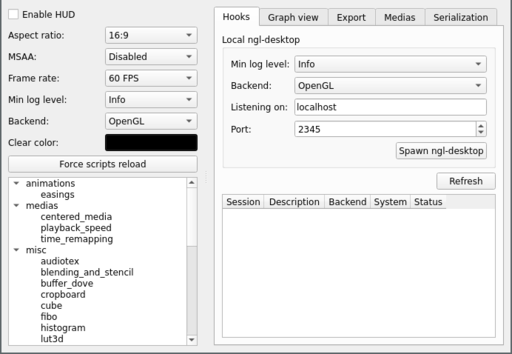
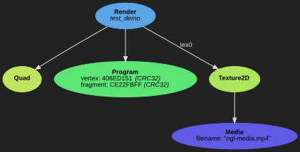
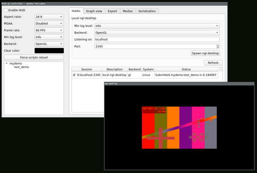
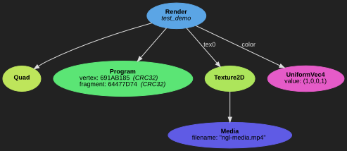
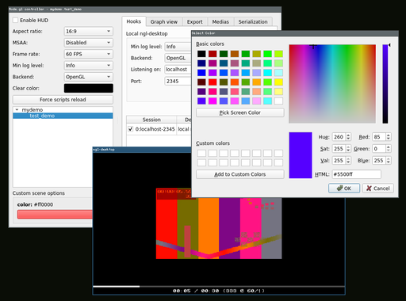
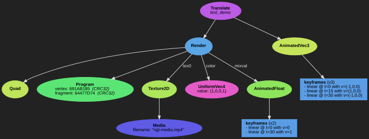
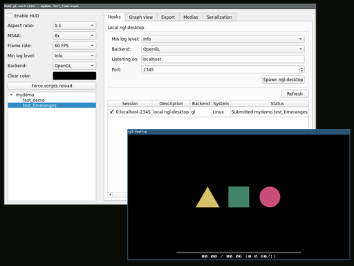

🔰 Starter tutorial
===================

This starter tutorial will guide you through the installation and basic usage
of `nope.gl`. At the end of this tutorial, you will be able to write your own
demo scripts in Python and how to read the advanced technical documentation for
your future creative adventures.

## 🏗️ Installation

Follow the ["Dependencies" and "Quick user installation" guides][install] to
bootstrap the nope.gl environment. The rest of the tutorial will assume you are
in that environment.

[install]: /usr/howto/installation.md

## 👁️ Running the controller

When running `ngl-control` for the first time and selecting a scene, you should
see something like this:



`ngl-control` doesn't render scenes directly, it's a controller which builds
scenes from Python sources, then communicates the result to `ngl-desktop` for
rendering. `ngl-desktop` is the native rendering player on desktop.

So to be of any use, you will need one or more instances of `ngl-desktop`
running on your machine first. You can either spawn them manually, or use the
"Spawn ngl-desktop" button. The widgets above that button translates directly
to the command-line options of `ngl-desktop`. You can not spawn several
instances of `ngl-desktop` on the same port, but you are free to pick another
port to spawn another instance, typically with a different configuration
(such as another rendering backend).

When `ngl-desktop` instances are running, you can press the "Refresh" button
below, and you should see them appear in the list. This list is where you
control which instance(s) you want to communicate with.

Now on the bottom-left, you should see a bunch of scene examples. After
selecting one, the `ngl-desktop` instances should update shortly after. Each
`ngl-desktop` instance is independant, and you can control the playback by
toggling pause (space) or seeking (arrows, mouse clicking, ...).

All the scenes listed on the left tree view can be found in the
[pynopegl_utils.examples][demo-tree] Python module. If you are curious on how
each demo scene operates, look into this place.

Also note that `ngl-control` supports live code editing by monitoring the files
associated with the available scenes. The current scene will be reconstructed
after every change in the sources.

On the top-left part of the controller, you can control the generic parameters
sent to each scene when they are constructed. Try to play with them and see how
it affects the running `ngl-desktop` instances. Some scenes may decide to
override these parameters (it's usually the aspect ratio). A red message will
appear in the interface close to the affected settings to notify when this
happens.

Some scenes also have specific custom settings that will appear as widgets
below the scene list.

You may also notice the tabs, which offers different features and controls. One
of them is the *Medias* tab, where you control the assets provided to the
scenes for their composition.

The default video being an overly saturated mire generated with FFmpeg, it is
not a very interesting asset for most demos. It is suggested to select your own
assets using this tab, and then play around with the controller and its
default demos.

[demo-tree]: source:pynopegl-utils/pynopegl_utils/examples


## 🐍 Creating a simple scene in Python

### My first demo scene

Now that you are familiar with the controller, we are going to write our own
first demo.

Edit a script such as `~/mydemo.py` and add the following:

```python
import pynopegl as ngl
from pynopegl_utils.misc import scene


_VERTEX = '''
void main()
{
    ngl_out_pos = ngl_projection_matrix * ngl_modelview_matrix * vec4(ngl_position, 1.0);
    var_tex0_coord = (tex0_coord_matrix * vec4(ngl_uvcoord, 0.0, 1.0)).xy;
}
'''


_FRAGMENT = '''
void main()
{
    ngl_out_color = ngl_texvideo(tex0, var_tex0_coord);
}
'''


@scene()
def test_demo(cfg):
    geometry = ngl.Quad()
    media = ngl.Media(cfg.medias[0].filename)
    texture = ngl.Texture2D(data_src=media)
    program = ngl.Program(vertex=_VERTEX, fragment=_FRAGMENT)
    program.update_vert_out_vars(var_tex0_coord=ngl.IOVec2())
    render = ngl.Render(geometry, program)
    render.update_frag_resources(tex0=texture)
    return render
```

You should be able to preview your scene with `ngl-control -m ~/mydemo.py` and
observe a centered quadrilateral geometry with the video playing in it. But
first, let's look at the `Graph view` tab in the controller to understand the
scene we just crafted:



To formulate what we observe here, we'll say the following: the `Render` is the
node orchestrating the render of the `Texture2D` (identified by "*tex0*") in the
`Quad` geometry, using the `Media` as data source for filling the texture.

### Pimp my demo

**Note**: writing GLSL shaders is out of the scope of this tutorial, so we will
assume you are comfortable with the basis. If not, you may want to look at [the
book of shaders][book-of-shaders] or any beginner resource of your choice.

You may want to refer to the [vertex and fragment shader
parameters][expl-shaders] documentation to know which parameters are exposed by
`nope.gl`.

We are now going to pimp a little our fragment shader. Instead of just picking
into the texture, we will mix it with some red by replacing the `ngl_out_color`
assignment with the following:

```glsl
void main()
{
    vec4 color = vec4(1.0, 0.0, 0.0, 1.0);
    vec4 video = ngl_texvideo(tex0, var_tex0_coord);
    ngl_out_color = mix(video, color, 0.5);
}

```



[book-of-shaders]: http://thebookofshaders.com/
[expl-shaders]: /usr/expl/shaders.md

### Introducing uniforms

You may want to pass a bunch of parameters to your Program depending on how you
construct your scene. One way to do that is to craft a specific string for the
fragment shader. While this may make sense under certain rare circumstances,
in most cases you want to rely on **uniforms**. Uniforms will allow the re-use
of the same program in multiple renders, bringing maintenance and performance
benefits.

Setting up an uniform identified by "*color*" for our red color looks like
this:

```python
    ucolor = ngl.UniformVec4(value=(1,0,0,1))
    render.update_frag_resources(color=ucolor)
```

In the GLSL code, you will access it by replacing the `vec4 color` local to the
`main()` function into a `uniform vec4 color` on top, along with the other
uniform declarations.

If you've correctly followed the above instructions, your graph tree will look
like this:



### Scene widgets

One way to adjust the red color is to edit the code and observe the result
in the `ngl-control` immediately. Another way is to integrate a widget directly
in the UI. For that, we can adjust the `@scene()` decorator and the
`test_demo()` prototype like the following:

```python
@scene(controls=dict(color=scene.Color()))
def test_demo(cfg, color=(1,0,0)):
    ...
    ucolor = ngl.UniformVec3(value=color)
    ...
```



All the other widgets are documented in the [Controller widgets
documentation][controller-widgets].

[controller-widgets]: /usr/ref/pynopegl-utils.md#controller-widgets

### Animations

Some nodes support CPU animations, driven by the requested draw time.
Animations are composed of an interpolated holder (the animated node) and a set
of key frames.

One of the most common animation used is an animated uniform to represent time.
Typically, we want to access the normalized time in the fragment shader. But to
prevent any confusion we will create a more explicit shader parameter, how
about using a *mix value changing according to time*?

To achieve that in the construction of the scene, we will rely on
`cfg.duration` which contain the scene duration. By default, it is 30 seconds
long, but it can be changed directly in your function. We want to associate
`duration=0` with `mixval=0` and `duration=30` with `mixval=1`:

```python
    mixval_animkf = [ngl.AnimKeyFrameFloat(0, 0),
                     ngl.AnimKeyFrameFloat(cfg.duration, 1)]
    mixval_anim = ngl.AnimatedFloat(mixval_animkf)
```

And then use this animated float directly on the render:

```python
    render.update_frag_resources(mixval=mixval_anim)
```

Just like `color`, we will transmit it to the shader through uniforms.
The fragment shader ends up being:

```glsl
void main()
{
    vec4 video = ngl_texvideo(tex0, var_tex0_coord);
    ngl_out_color = mix(video, vec4(color, 1.0), mixval);
}
```

Uniforms are not the only nodes to support animation, nodes like
`Animated*`, `Camera`, or the transformation nodes we are studying next,
also support them.

### Transformations


Transformations come in 3 flavors: `Translate`, `Scale` and `Rotate`. Each of
these node can be stacked at will. Also, just like uniforms, they can be
animated according to time.

How about making our video *swing from left to right and back again*?

Let's first reduce the time of the demo to make things a bit more interesting:

```python
@scene(controls=dict(color=scene.Color()))
def test_demo(cfg, color=(1,0,0)):
    cfg.duration = 3.
    ...

```

And create the translation with our previous `Render` as child:

```python
    translate_animkf = [ngl.AnimKeyFrameVec3(0, (-1, 0, 0)),
                        ngl.AnimKeyFrameVec3(cfg.duration/2., (1, 0, 0)),
                        ngl.AnimKeyFrameVec3(cfg.duration, (-1, 0, 0))]
    translate_anim = ngl.AnimatedVec3(keyframes=translate_animkf)
    translate = ngl.Translate(render, vector=translate_anim)
    return translate
```



At this point, our demo code looks like this:

```python
import os.path as op
import pynopegl as ngl
from pynopegl_utils.misc import scene


_VERTEX = '''
void main()
{
    ngl_out_pos = ngl_projection_matrix * ngl_modelview_matrix * vec4(ngl_position, 1.0);
    var_tex0_coord = (tex0_coord_matrix * vec4(ngl_uvcoord, 0.0, 1.0)).xy;
}
'''


_FRAGMENT = '''
void main()
{
    vec4 video = ngl_texvideo(tex0, var_tex0_coord);
    ngl_out_color = mix(video, vec4(color, 1.0), mixval);
}
'''


@scene(controls=dict(color=scene.Color()))
def test_demo(cfg, color=(1,0,0)):
    cfg.duration = 3.

    # Render branch for my video
    geometry = ngl.Quad()
    media = ngl.Media(cfg.medias[0].filename)
    texture = ngl.Texture2D(data_src=media)
    prog = ngl.Program(vertex=_VERTEX, fragment=_FRAGMENT)
    prog.update_vert_out_vars(var_tex0_coord=ngl.IOVec2())
    render = ngl.Render(geometry, prog)
    render.update_frag_resources(tex0=texture)

    # Animated mixing color
    mixval_animkf = [ngl.AnimKeyFrameFloat(0, 0),
                     ngl.AnimKeyFrameFloat(cfg.duration, 1)]
    mixval_anim = ngl.AnimatedFloat(mixval_animkf)
    ucolor = ngl.UniformVec3(color)
    render.update_frag_resources(color=ucolor, mixval=mixval_anim)

    # Translation
    translate_animkf = [ngl.AnimKeyFrameVec3(0, (-1, 0, 0)),
                        ngl.AnimKeyFrameVec3(cfg.duration/2., (1, 0, 0)),
                        ngl.AnimKeyFrameVec3(cfg.duration, (-1, 0, 0))]
    translate_anim = ngl.AnimatedVec3(keyframes=translate_animkf)
    translate = ngl.Translate(render, vector=translate_anim)

    return translate
```

Little exercise suggestion: make your video do a 360° rotation using the
`Rotate` node.

### Playing with time (time range filters)

One last important brick in the `nope.gl` creative workflow is the time range
control. Assuming your demo is segmented in multiple time sections, you will
need the help of the `TimeRangeFilter` node.

We will start with the current new scene template:

```python
import math
import pynopegl as ngl
from pynopegl_utils.misc import scene

...

@scene()
def test_timeranges(cfg):
    cfg.duration = 6.0

    # 3 basic different shapes
    sz = 1/3.
    b = sz * math.sqrt(3) / 3.0
    c = sz * .5
    triangle = ngl.Triangle((-b, -c, 0), (b, -c, 0), (0, sz*.5, 0))
    square = ngl.Quad((-sz/2, -sz/2, 0), (sz, 0, 0), (0, sz, 0))
    circle = ngl.Circle(radius=sz/2., npoints=64)

    # Renders for each shape, sharing a common program for coloring
    prog = ngl.Program(vertex=cfg.get_vert('color'), fragment=cfg.get_frag('color'))
    renders = [
            ngl.Render(triangle, prog),
            ngl.Render(square, prog),
            ngl.Render(circle, prog),
    ]

    # Associate a different color for each shape
    for r in renders:
        color = [cfg.rng.random() for i in range(3)]
        r.update_frag_resources(color=ngl.UniformVec3(value=color), opacity=ngl.UniformFloat(value=1))

    # Move them in different places
    translates = [
            ngl.Translate(renders[0], (-.5, 0, 0)),
            ngl.Translate(renders[1], (  0, 0, 0)),
            ngl.Translate(renders[2], ( .5, 0, 0)),
    ]

    # final group holding every render
    return ngl.Group(translates)
```

This template is using nodes we already met, with the introduction of the
following new ones:

- `Triangle` and `Circle`, which are just like `Quad`: basic geometries
- a `Group` as root node, for rendering multiple `Render`

You may also notice we picked a basic coloring fragment from `pynopegl_utils`
with `get_frag('color')`, grabbing the content of [color.frag][color-frag].

[color-frag]: source:pynopegl-utils/pynopegl_utils/examples/shaders/color.frag



Now back on the original topic: how are we going to *make each shape appear and
disappear according to time?*

`TimeRangeFilter` can limit draw events to a given time segment, for example:

```python
    node = ngl.TimeRangeFilter(child, start=1, end=4)
```

Applying this new knowledge to our demo we can make our shapes appear and
disappear rhythmically:

```python
    ranges = [(1, 4), (2, 5), (3, 6)]
    range_filters = [
        ngl.TimeRangeFilter(translate, start=time_segment[0], end=time_segment[1])
        for (translate, time_segment) in zip(translates, ranges)
    ]
    return ngl.Group(range_filters)
```


## 🏊 Diving into the documentation

From here, if you you're looking at a specific area, you may want to look at
the [how-to guides][howto].

If you need to understand the *why* of certain design decisions or limitations,
the [discussions and explanations][expl] section will come to an help.

Finally, in every situation, you will feel the need to check out the [reference
documentation][refdoc] for austere but exhaustive information, and in
particular, [all the node definitions][ref-libnopegl]. The [pynopegl-utils
reference documentation][ref-pynopegl-utils] will typically offer many helpers
when starting a creative process.

[howto]:                 /usr/howto/index.md
[expl]:                  /usr/expl/index.md
[refdoc]:                /usr/ref/index.md
[ref-libnopegl]:         /usr/ref/libnopegl.md
[ref-pynopegl-utils]:    /usr/ref/pynopegl-utils.md
